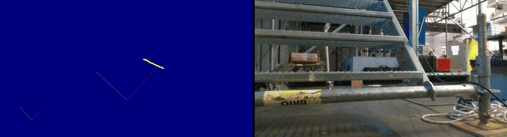

# Main page of dataset done by ESIGELEC

# Index of datasets :

* [lidar/imu 3d mapping Utacceram](https://github.com/vauchey/mappingUtacceram)

    

* [lidar/imu/RGBD datasets around the ESIGELEC with several seasons](https://github.com/vauchey/StaircaseLocalization)

    

* [RGBD/Vicon dataset on industrial Stairs](https://github.com/vauchey/StaircaseLocalization)
    

